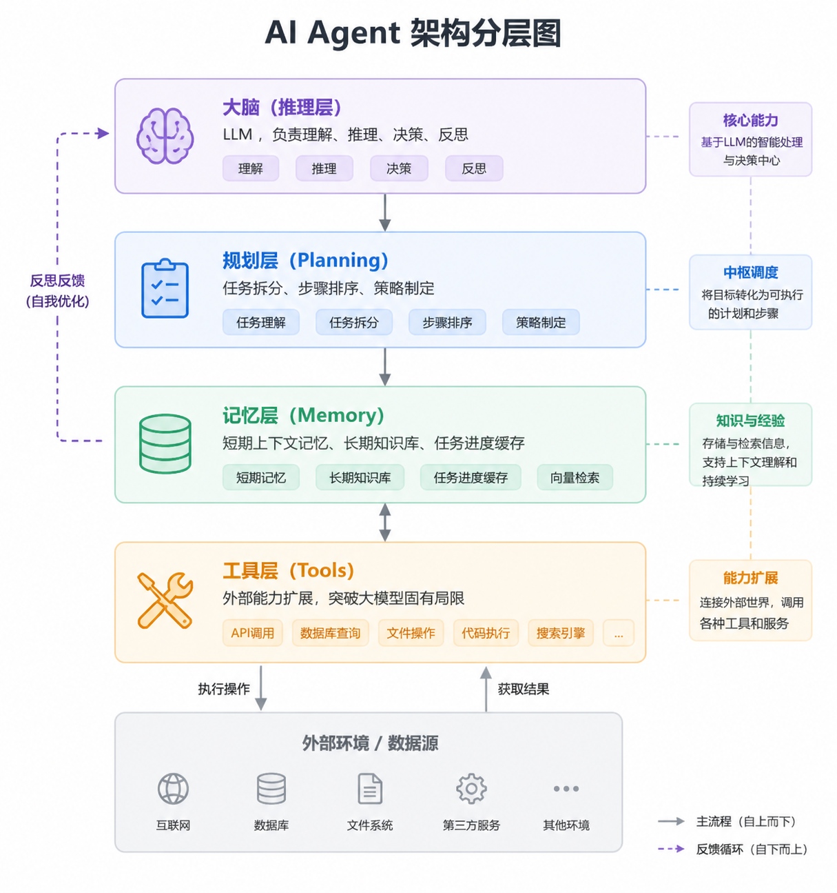

## 前言

"Agent" 直译“代理人”的意思，是计算机、软件工程通用术语，早就存在，和 AI 无关。

随着AI的发展，Agent的概念被广泛应用于人工智能体系统中，AI Agent便诞生了。现在大部分Agent其实指的就是AI Agent。

但对于一个刚刚接触Agent的开发人员来说，Agent其实是一个比较复杂的概念。本文将为你提供一个简单的入门指南，带你快速上手Agent的开发。

## 一、AI Agent是什么

所以，AI Agent到底是什么呢？我们先来了解一下它的基础信息。

### 1.核心定义

AI Agent（人工智能智能体）：以大模型 LLM（Large Language Model，大语言模型）为核心，具备自主规划、环境感知、工具调用、记忆存储、循环迭代执行能力，以完成指定目标为核心的人工智能系统。区别于传统被动问答 AI，具备主动行动能力。

### 2.核心本质公式

\(\boldsymbol{AI\ Agent = LLM + 规划 + 记忆 + 工具 + 环境交互}\)

### 3.五大核心能力

- **自主性**：无需人类逐指令引导，自主判断下一步行为
- **目标驱动**：接收最终任务，自动拆解子任务、闭环落地
- **感知能力**：接收外部信息（文本、接口数据、文件、环境状态）
- **工具调用**：主动使用外部能力（搜索、代码、数据库、API、爬虫）
- **反思迭代**：执行失败后自我纠错、调整方案，循环重试

### 4.基础运行闭环（核心逻辑）

感知环境 → LLM 推理思考 → 制定行动规划 → 调用工具执行 → 接收结果反馈 → 反思修正 → 持续循环直到任务完成 / 终止条件触发。

### 5.四大基础组成模块

- **大脑（推理层）**：LLM，负责理解、推理、决策、反思
- **规划层（Planning）**：任务拆分、步骤排序、策略制定
- **记忆层（Memory）**：短期上下文记忆、长期知识库、任务进度缓存
- **工具层（Tools）**：外部能力扩展，突破大模型固有局限



### 6.关键区分：AI Agent vs 普通大模型

- **普通 LLM**：被动响应，一问一答，无执行链路，不会主动调用工具
- **AI Agent**：主动执行，多步串联、自主决策、复杂长任务落地

### 7.一句话总结

AI Agent 是一个以大模型 LLM 为核心，具备自主规划、环境感知、工具调用、记忆存储、循环迭代执行能力，以完成指定目标为核心的人工智能系统。

## 二、如何使用AI Agent

我们了解了AI Agent的基本信息之后，那么我想问，我哪里会用的上它呢？其实也就是，AI Agent 的能满足的需求有哪些？

1. **自动化任务**：如数据清洗、数据处理、数据可视化等，通过AI Agent可以实现自动执行，减少人工操作。
2. **复杂决策**：如金融交易、医疗诊断、法律分析等，AI Agent可以根据环境信息和工具能力，自主判断下一步行为。
3. **多任务协调**：如协调多个智能体合作完成任务，AI Agent可以实现任务的并行执行和协调。

### AI Agent 的应用最终形式

当我知道它的基本信息、应用之后，开发之前，我还有一个问题，就是AI Agent最终应该以什么形式出现在用户面前？

其实有很多：

1. **网页**：将AI Agent嵌入到网页中，用户可以在网页上与AI Agent进行交互。
2. **应用**：开发一个独立的应用，用户可以通过应用与AI Agent进行交互。
3. **机器人**：将AI Agent部署为一个机器人，用户可以通过机器人与AI Agent进行交互。
4. **语音助手**：将AI Agent部署为一个语音助手，用户可以通过语音与AI Agent进行交互。

AI Agent作为一个系统，确实可以根据不同的需求和场景嵌入到各种形式中。

## 三、如何开发AI Agent

ok,相信你已经了解了AI Agent的基本信息和应用场景。那么，我们来了解一下如何开发AI Agent。

### 1.架构设计

在开发AI Agent时，通常的架构设计需要包含以下几个主要组件：

- **推理层（大脑层）**：负责理解、推理、决策和反思。通常使用自然语言处理（NLP）和深度学习模型（如LLM，GPT等）来实现。
- **规划层（Planning）**：负责任务拆分、步骤排序和策略制定，将大脑层的输出转化为具体的操作。
- **记忆层（Memory）**：保存上下文、任务进度和长期知识。确保Agent在多轮交互或长时间操作下不丢失重要的信息。
- **工具层（Tools）**：扩展Agent的外部能力，通常通过API调用或其他工具来执行复杂的任务，突破大模型固有的局限。

**推荐的整体架构**：

- **前端（UI层）**：用户与Agent的交互界面。
- **后端（API层）**：处理所有AI逻辑、模型推理、数据存储等。
  - 推理层：处理核心推理，调用大语言模型等。
  - 规划层：任务拆解与执行策略。
  - 记忆层：存储上下文和知识。
  - 工具层：调用外部API或执行特定操作。

### 2.所需准备工作

在开发AI Agent项目之前，以下是需要学习和准备的知识和工具：

下面是一些市面上主流的技术栈：
| 类别 | 技术 | 用途 |
| --- | --- | --- |
| 编程语言 | Python, Node.js | Python：深度学习、机器学习、NLP； Node.js：Web应用开发 |
| 深度学习框架 | TensorFlow, PyTorch, Hugging Face Transformers, LangChain | 深度学习模型构建与推理，NLP任务，LLM集成（LangChain） |
| API框架 | Flask, FastAPI, Express, GraphQL | 构建API服务，处理HTTP请求，GraphQL用于复杂数据查询 |
| 数据库与存储 | PostgreSQL, MySQL, MongoDB, Redis, Neo4j | 存储任务数据、用户信息、知识库，缓存短期记忆，图数据库 |
| 任务调度与规划 | RQ, Celery, OpenAI Gym, Stable Baselines | 异步任务调度，强化学习，用于任务分解和策略生成 |
| 容器化与部署 | Docker, Kubernetes, CI/CD工具（GitLab CI, Jenkins, GitHub Actions） | 容器化应用，自动化部署与扩展，持续集成与部署 |
| 云平台 | AWS, Google Cloud, Azure | 云计算平台，托管模型与数据库，大规模计算资源 |
| 前端技术 | React, Vue.js, Socket.io | 前端框架，用于开发Web应用，Socket.io用于实时通信 |
| 安全性与认证 | OAuth 2.0, JWT, HTTPS/SSL, 加密技术 | API身份验证与授权，确保数据传输的安全性 |

#### Node.js 项目案例

1. **创建项目并安装依赖**

首先，创建一个新的 Node.js 项目并安装所需的依赖：

```bash
# 创建项目文件夹
mkdir ai-agent-node
cd ai-agent-node

# 初始化Node.js项目
npm init -y

# 安装必需的依赖
npm install express langchain openai dotenv body-parser axios
```

2. **项目目录结构**

初始化项目后，项目目录结构如下：

```
ai-agent-node/
├── node_modules/           # Node.js依赖包
├── src/
│   ├── app.js              # 应用入口文件
│   ├── config.js           # 配置文件
│   ├── agent/              # AI代理相关逻辑
│   │   ├── agentController.js  # 代理控制器，处理请求
│   │   └── agentService.js    # 代理服务层，包含AI业务逻辑
│   ├── models/             # 用于存储模型相关逻辑（如大语言模型）
│   │   └── languageModel.js  # 与LangChain交互的代码
│   ├── routes/             # API路由文件夹
│   │   └── agentRoutes.js   # 定义与AI Agent交互的API
│   ├── utils/              # 工具类文件
│   │   └── apiUtils.js      # 封装API请求
│   ├── .env                # 环境变量配置
├── .gitignore              # 用于Git忽略文件
├── package.json            # 项目配置和依赖
└── package-lock.json       # 锁定依赖的版本
```

3. **目录结构介绍与文件功能**

- **node_modules/**
  - 功能：包含安装的所有依赖库（如 express, langchain, dotenv 等），不需要直接操作。
  - 为什么有这个目录：Node.js项目管理依赖的标准方式。

- **src/**
  这是项目的主要代码目录，所有与功能实现相关的代码都放在此目录下。
  - **app.js**
    - 功能：应用的入口文件，负责启动Express服务器，配置路由，并初始化中间件。
    - 为什么有这个文件：这是Node.js应用的标准入口文件，负责初始化应用和所有依赖，确保后端服务可以运行。

    ```javascript
    const express = require('express');
    const bodyParser = require('body-parser');
    const agentRoutes = require('./routes/agentRoutes');
    const app = express();

    // 使用body-parser中间件来解析JSON请求
    app.use(bodyParser.json());

    // 配置路由
    app.use('/api/agent', agentRoutes);

    // 启动服务器
    const port = process.env.PORT || 3000;
    app.listen(port, () => {
      console.log(`Server running on port ${port}`);
    });
    ```

  - **config.js**
    - 功能：存储应用配置，如环境变量、数据库连接信息、API密钥等。
    - 为什么有这个文件：集中管理配置信息，便于项目维护和扩展，避免硬编码。

    ```javascript
    require('dotenv').config();

    module.exports = {
      openaiApiKey: process.env.OPENAI_API_KEY, // OpenAI API密钥
      port: process.env.PORT || 3000,
    };
    ```

  - **agent/**
    这个文件夹专门用于存放与AI代理（Agent）相关的业务逻辑和控制层代码。
    - **agentController.js**：处理接收到的请求，调用服务层（agentService.js）处理实际的业务逻辑，然后将结果返回给前端。
    - **agentService.js**：负责与LangChain或其他AI服务进行交互，处理具体的AI逻辑（如生成回复、任务规划等）。

  - **models/**
    用于存储与模型相关的代码，通常包括与第三方AI平台（如OpenAI）的接口交互代码。
    - **languageModel.js**：集成LangChain或其他大语言模型（如GPT-3），为代理提供推理能力。

  - **routes/**
    路由层，负责定义API的端点和路径。
    - **agentRoutes.js**：定义与Agent相关的API路由，通常会映射到代理控制器（agentController.js）的方法。

    ```javascript
    const express = require('express');
    const router = express.Router();
    const agentController = require('../agent/agentController');

    // 定义POST请求路由，处理AI Agent查询
    router.post('/query', agentController.queryAgent);

    module.exports = router;
    ```

  - **utils/**
    工具类文件，存放项目中常用的函数、API请求封装、格式化工具等。
    - **apiUtils.js**：封装API请求相关的工具函数，如与外部API交互的通用逻辑。

  - **.env**
    - 功能：存储环境变量，如API密钥、端口号等。
    - 为什么有这个文件：确保敏感信息不暴露在代码中，使用.env进行管理可以让不同环境的配置更加灵活。

    ```
    OPENAI_API_KEY=your_openai_api_key
    PORT=3000
    ```

  - **.gitignore**
    - 功能：指定Git需要忽略的文件或目录（如node_modules/、.env等）。
    - 为什么有这个文件：避免将敏感信息或不必要的依赖上传到Git仓库。
    ```
    node_modules/
    .env
    ```

4. **必要操作与补充**

- **环境配置**：在本地开发时，确保.env文件中配置了正确的API密钥和端口号。
- **运行项目**：确保在开发过程中可以使用`node app.js`启动服务器。
- **测试API**：你可以使用Postman等工具，向`POST /api/agent/query`发送请求，并验证API的返回结果。

## 四、总结

通过本文的学习，我们对AI Agent有了全面的了解：

### 核心概念

- AI Agent是以大模型LLM为核心，具备自主规划、环境感知、工具调用、记忆存储、循环迭代执行能力的人工智能系统
- 核心本质公式：`AI Agent = LLM + 规划 + 记忆 + 工具 + 环境交互`
- 区别于普通大模型，AI Agent具有主动执行能力，能够完成复杂的长任务

### 应用场景

- **自动化任务**：如数据清洗、处理、可视化等
- **复杂决策**：如金融交易、医疗诊断、法律分析等
- **多任务协调**：协调多个智能体合作完成任务

### 开发要点

- **架构设计**：包含推理层、规划层、记忆层、工具层等核心组件
- **技术栈**：Python/Node.js、深度学习框架、API框架、数据库、容器化技术等
- **项目结构**：合理组织代码，分离关注点，提高可维护性

### 实践步骤

- 初始化项目并安装必要依赖
- 设计合理的目录结构
- 实现核心功能模块
- 配置环境变量和部署策略

AI Agent作为人工智能的重要发展方向，正在各个领域展现出巨大的潜力。通过本文提供的入门指南，希望你能够快速上手AI Agent的开发，探索更多可能性。

随着技术的不断进步，AI Agent的能力将不断增强，为我们的工作和生活带来更多便利。期待你在AI Agent领域的创新和贡献！
