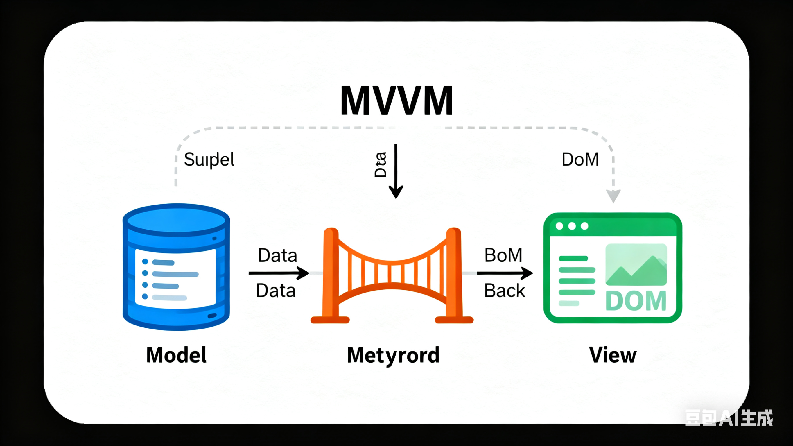

当前比较流行的框架都采用的是MVVM方式。

#### 那么，什么是MVVM？

MVVM是Model-View-ViewModel的简写。本质上是MVC的改进版，MVVM，其中的View是**视图状态及行为**抽象化出来，Model去实现**业务逻辑**，而ViewModel作为中枢，实现**视图UI和业务数据**的更新。

简单来说——**数据驱动试图**，让数据变成“响应式”，数据变化时自动触发视图自动变化。

MVVM 把前端应用拆分为 3 个核心部分，本质是**解耦数据、视图、业务逻辑**：

| 角色      | 作用                                                                              | 对应前端场景                        |
| --------- | --------------------------------------------------------------------------------- | ----------------------------------- |
| Model     | 数据层：存储 / 管理业务数据（纯数据，无 UI 逻辑）                                 | 如 Vue 中的 `data`、接口返回的 JSON |
| View      | 视图层：用户看到的 DOM 界面（纯展示，无业务逻辑）                                 | 如 `<div>{{name}}</div>`、按钮等    |
| ViewModel | 桥梁层：连接 Model 和 View，核心是「数据劫持 / 响应式」+「模板编译」+「更新视图」 | Vue 实例本身（`new Vue({})`）       |



核心逻辑：

`Model 变化 → ViewModel 感知 → 自动更新 View`

`View 交互（如点击输入）→ ViewModel 处理 → 自动更新 Model`

#### **数据驱动试图的底层原理**

数据驱动视图的本质是：**让数据变成 “响应式”，数据变化时自动触发视图更新**

以Vue2为例，核心分为三步

##### 1\. 第一步：数据劫持（响应式核心）—— 监听数据变化

Vue 2 通过 `Object.defineProperty` 劫持 `data` 中所有属性的 `get/set` 方法，Vue 3 用 `Proxy`（更强大），目的是：

- 读取数据时（`get`）：收集 “依赖”（即哪些视图用到了这个数据）；
- 修改数据时（`set`）：触发 “更新”（通知所有依赖这个数据的视图重新渲染）。

```javascript
// 模拟数据劫持：把普通对象变成响应式
function defineReactive(obj, key, val) {
  // 递归处理嵌套对象（如 data.user.name）
  observe(val);

  // 劫持 get/set
  Object.defineProperty(obj, key, {
    get() {
      // 收集依赖：记录“这个数据被哪个视图用到了”
      Dep.target && dep.addDep(Dep.target);
      return val;
    },
    set(newVal) {
      if (newVal === val) return;
      val = newVal;
      observe(newVal); // 新值如果是对象，也要劫持
      // 触发更新：通知所有依赖这个数据的视图更新
      dep.notify();
    },
  });
}

// 递归遍历对象，给所有属性做劫持
function observe(obj) {
  if (typeof obj !== 'object' || obj === null) return;
  Object.keys(obj).forEach((key) => {
    defineReactive(obj, key, obj[key]);
  });
}
```

##### 2\. 第二步：依赖收集（Dep）—— 记录 “数据→视图” 的映射

每个响应式属性对应一个 `Dep`（依赖管理器），作用是：

- 存储所有 “用到这个属性的视图更新函数（Watcher）”；
- 数据变化时，`Dep` 通知所有 `Watcher` 执行更新。

```javascript
class Dep {
  constructor() {
    this.subs = []; // 存储所有 Watcher
  }
  // 添加依赖（Watcher）
  addDep(watcher) {
    this.subs.push(watcher);
  }
  // 通知所有 Watcher 更新
  notify() {
    this.subs.forEach((watcher) => watcher.update());
  }
}
```

##### 3\. 第三步：视图更新（Watcher）—— 执行视图渲染

`Watcher` 是 “视图更新的执行者”，每个视图节点（如 `{{name}}`）对应一个 `Watcher`：

- 初始化时：执行 `get` 方法，触发数据的 `get` 钩子，把自己加入 `Dep`；
- 数据变化时：`Dep` 通知 `Watcher` 执行 `update`，重新渲染视图（更新 DOM）。

```javascript
class Watcher {
  constructor(vm, expr, cb) {
    this.vm = vm; // Vue 实例
    this.expr = expr; // 数据表达式（如 'name'）
    this.cb = cb; // 视图更新的回调（更新 DOM）
    this.value = this.get(); // 初始化：触发 get，收集依赖
  }
  // 读取数据，触发 get 钩子
  get() {
    Dep.target = this; // 把当前 Watcher 标记为“待收集的依赖”
    const value = this.vm[this.expr]; // 读取数据，触发 get
    Dep.target = null; // 清空标记
    return value;
  }
  // 数据变化时，执行更新回调
  update() {
    const newVal = this.vm[this.expr];
    this.cb(newVal); // 调用回调更新 DOM
  }
}
```

#### MVVM 数据驱动视图的完整流程（以 Vue 为例）

以 `new Vue({ data: { name: '张三' } })` + `<div>{{name}}</div>` 为例，完整执行流程：

##### 1\. 初始化阶段

1.  **数据响应式化**：Vue 遍历 `data` 中的 `name`，用 `Object.defineProperty` 劫持 `get/set`，并创建对应的 `Dep`；
2.  **模板编译**：解析 `<div>{{name}}</div>`，把模板转为渲染函数（`render`），识别出 “用到了 `name` 这个数据”；
3.  **创建 Watcher**：为 `{{name}}` 这个视图节点创建 `Watcher`，执行 `get` 方法读取 `name`，触发 `name` 的 `get` 钩子，把 `Watcher` 加入 `name` 的 `Dep`；
4.  **初始渲染**：`Watcher` 读取 `name` 的值（' 张三 '），渲染到 DOM 中，页面显示 “张三”。

##### 2\. 数据更新阶段（如 `this.name = '李四'`）

1.  赋值操作触发 `name` 的 `set` 钩子；
2.  `set` 钩子调用 `name` 的 `Dep.notify()`；
3.  `Dep` 遍历所有已收集的 `Watcher`，调用 `Watcher.update()`；
4.  `Watcher` 执行更新回调，把 DOM 中的 “张三” 替换为 “李四”；
5.  视图自动更新，无需手动操作 DOM。

#### 核心总结

1.  **MVVM 的本质**：用 ViewModel 层隔离 Model 和 View，通过 “响应式数据” 实现双向绑定，解耦 DOM 操作和业务逻辑；
2.  **数据驱动视图的核心**：
    - 数据劫持（`Object.defineProperty/Proxy`）：监听数据变化；
    - 依赖收集（Dep）：记录 “数据→视图” 的映射；
    - 视图更新（Watcher）：数据变化时自动更新 DOM；
3.  **前端意义**：开发者只需关注数据逻辑，无需手动操作 DOM，大幅提升开发效率（这也是 jQuery 到 Vue/React 的核心变革）。
