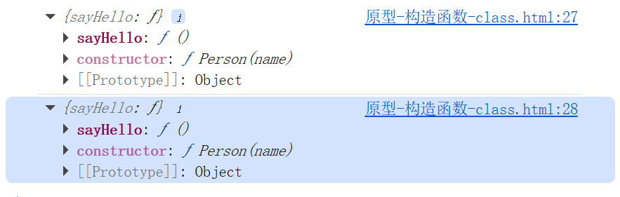
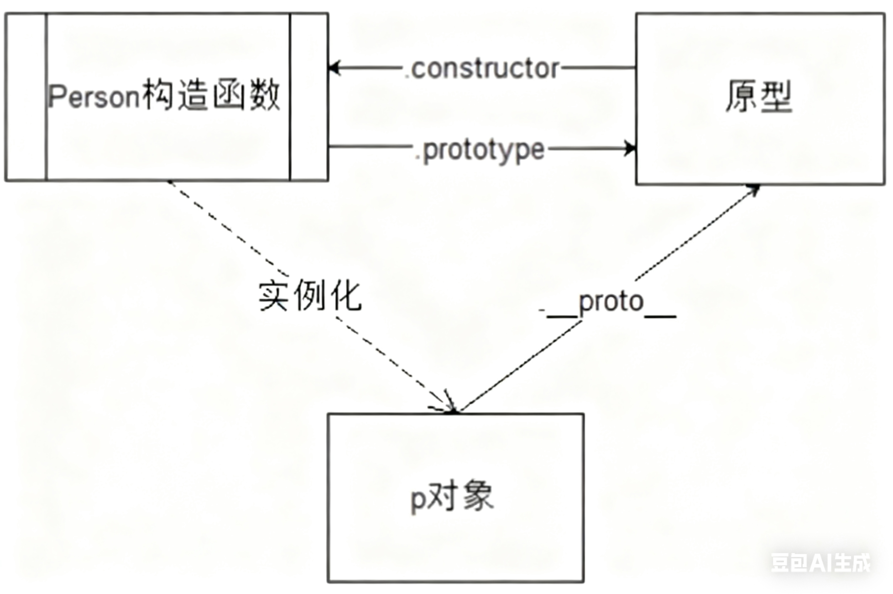

在ES6（2015年发布）引入class的语法之前，JavaScript 中并没有原生的类概念，而是通过**构造函数**和**原型（prototype）** 机制来实现类似 “类” 的功能。

```javascript
// 构造函数（用于初始化实例属性）
function Person(name) {
  this.name = name; // 实例属性
}

// 原型上定义共享方法
Person.prototype.sayHello = function() {
  console.log(`Hello, ${this.name}`);
};

// 创建实例
const person1 = new Person('Alice');
const person2 = new Person('Bob');

person1.sayHello(); // 共享原型上的方法
person2.sayHello();
```

原型**（prototype）**
-----------------

**概念：**在构造函数创建的时候，系统默认的帮构造函数创建并关联一个对象 这个对象就是原型

**作用：**在原型中的所有属性和方法，都可以被和其关联的构造函数创建出来的所有的对象共享

**访问原型：**构造函数名.prototype     实例化的对象.\_\_proto \_\_

```javascript
//......继续使用上方的例子 
console.log(Person.prototype );
console.log(person1.__proto__);
```

结果为：



#### 1\. prototype

**含义：** 是一个**函数**的属性，这个属性是一个指针，指向原型对象

**作用：** 构造函数调用 访问该构造函数所关联的原型对象

#### 2. **proto**

**含义：** 是一个**对象**拥有的内置属性，是js内部使用寻找原型链的属性，通过该属性可以允许实例对象直接访问到原型

#### 3\. constructor

**含义：**是原型对象的一个特殊属性，指向创建该原型对象的构造函数。

综合上述，我们能够看出

