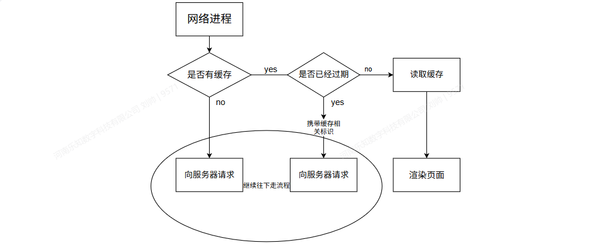
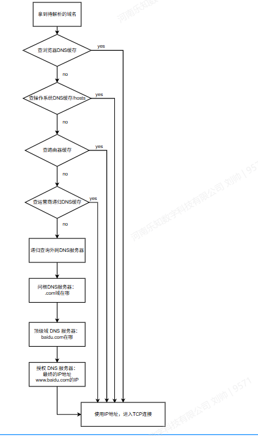
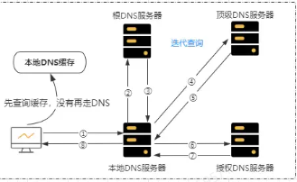
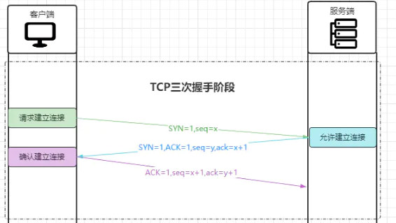
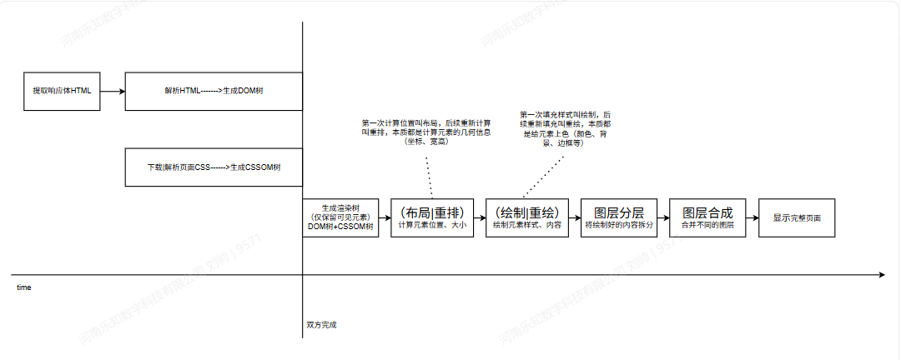
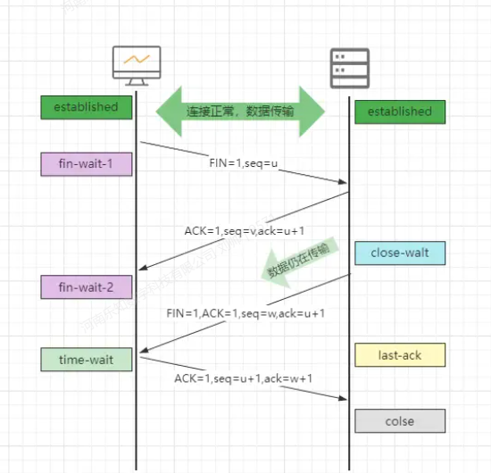
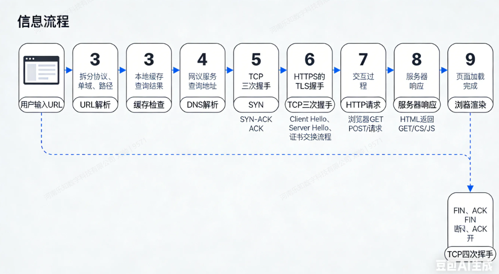

## 前言

当我们在浏览器导航栏输入URL之后，按下回车enter就会跳转到这个页面。

从输入URL开始，后面都发生了什么？

## 一、URL解析

浏览器第一步会对输入的 URL 进行结构化拆解，明确请求的协议、目标服务器、资源位置等关键信息，这是整个网络流程的起点。

比如：https://www.example.com:8080/blog/article?id=123&page=2#comment-456

| 组成部分         | 示例内容          | 代表含义                                                                                                             |
| ---------------- | ----------------- | -------------------------------------------------------------------------------------------------------------------- |
| 协议 (Scheme)    | `https`           | 通信协议，这里是加密的 HTTPS（比 HTTP 更安全），也可以是 `http`/`ftp` 等                                             |
| 域名 (Domain)    | `www.example.com` | 要访问的服务器 "名字"，相当于网络里的 "门牌号"，后续会通过 DNS 解析成 IP 地址                                        |
| 端口 (Port)      | `:8080`           | 服务器上的服务入口，HTTPS 默认是 `443`，HTTP 默认是 `80`；这里显式指定了 `8080`（如果 URL 里没写，就用协议默认端口） |
| 路径 (Path)      | `/blog/article`   | 服务器上的资源路径，对应 "文件夹 / 文件" 结构，这里表示要访问博客的文章页面                                          |
| 查询参数 (Query) | `?id=123&page=2`  | 传给服务器的指令 / 数据，用 `&` 分隔多个参数；这里表示 "查看 id=123 的文章，显示第 2 页"                             |
| 片段 (Fragment)  | `#comment-456`    | 客户端内部定位锚点，不会发给服务器；这里表示页面加载后直接跳转到 id 为 `comment-456` 的评论位置                      |

## 二、浏览器检查缓存

URL 解析完成后，浏览器不会直接发起网络请求，而是会优先检查本地缓存，目的是避免重复请求、提升页面加载速度、节省网络资源。



## 三、DNS域名解析

当本地缓存未命中时，浏览器仅拥有域名，无法直接与服务器通信（网络通信依赖 IP 地址），因此需要通过 DNS 服务将域名转换为服务器的 IP 地址。

DNS（Domain Name System，域名系统）

所谓DNS域名查询解析就是 域名——>IP地址



先查自己（浏览器）→ 再查电脑 → 再查家里 / 公司路由器 → 再查运营商 → 最后才去问互联网的 “根服务器”，是一套「尽量少跨网、优先用缓存」的优化策略，目的是让 DNS 解析尽可能快，同时减轻根服务器的压力。

（这张图后半段很详细）



## 四、建立TCP连接

当DNS解析完成，拿到IP地址的时候，浏览器会自动开始跟TCP建立连接

### 1.TCP三次握手

TCP 是可靠的面向连接的传输协议，必须通过「三次握手」确认双方的收发能力，才能建立连接。

在浏览器访问网站的场景下：

- 客户端：就是你本地电脑上运行的浏览器进程（比如 Chrome、Edge），它主动发起 TCP 连接请求。

- 服务端：就是你要访问的目标网站服务器（比如百度、淘宝的远程服务器），它被动等待并接受连接。

在TCP中，「客户端 / 服务端」是连接角色，不是固定的硬件：

- 客户端：主动发起连接的一方（谁先喊「我要连接」，谁就是客户端）

- 服务端：被动监听、接受连接的一方（谁在等别人来连，谁就是服务端）



- 第一次握手：客户端发送 `SYN`（同步序列编号），告知服务器「我要发起连接，我的数据流起点是 X（初始序列号）」，进入 `SYN_SENT` 状态。

- 第二次握手：服务器收到 `SYN`，回复 `SYN+ACK`，告知客户端「我收到了（ACK=1），我也要和你连接（SYN=1），我的数据流起点是 Y，确认收到了你的 X，但是下次希望你从x+1开始（因为第一次握手会占用一个序列号）」，进入 `SYN_RCVD` 状态。

- 第三次握手：客户端收到 `SYN+ACK`，回复 `ACK`，告知服务器「我知道了（ACK=1），我确认你的起点是Y，但是下次序列号你得从Y+1开始」，双方进入 `ESTABLISHED` 状态，连接正式建立。

| 字段 | 全称                  | 含义                                                                         | 理解                                                                |
| ---- | --------------------- | ---------------------------------------------------------------------------- | ------------------------------------------------------------------- |
| SYN  | Synchronize           | 同步标志位，`SYN=1` 表示这是一个「连接请求」或「连接接受」报文               | 连接邀请：只有在建立连接时才会置 1，用来同步双方初始序列号。        |
| ACK  | Acknowledgment        | 确认标志位，`ACK=1` 表示「确认号」字段有效                                   | 我知道了                                                            |
| seq  | Sequence Number       | 序列号，本报文段发送数据的第一个字节的编号；连接建立时用来同步双方初始序列号 | 我的起点:每一方都要告诉对方「我从哪个数字开始编号数据」。           |
| ack  | Acknowledgment Number | 确认号，期望收到对方下一个报文段的第一个字节的编号，只有 `ACK=1` 时才有效    | 我要下一个:告诉对方「你上次发的我收到了，下次请从这个数字开始发」。 |
| FIN  | Finish                | 结束标志位，FIN=1 表示本方数据发送完毕，请求关闭连接                         | 我发完了，要关通道                                                  |

| 状态名称    | 所属方 | 含义 & 场景                                             | 通俗理解                   |
| ----------- | ------ | ------------------------------------------------------- | -------------------------- |
| SYN_SENT    | 客户端 | 客户端已发送 SYN 连接请求，等待服务器回复 SYN+ACK       | 我发起连接了，等你回应     |
| SYN_RCVD    | 服务端 | 服务端已收到 SYN 并回复 SYN+ACK，等待客户端最后一次 ACK | 我同意连接了，等你最终确认 |
| ESTABLISHED | 双方   | 三次握手完成，TCP 连接已建立，可正常收发数据            | 连接通了，开始传输数据     |

**问答：在握手期间为什么要相互确认数据流起点也就是发送seq？**

TCP 把要传输的数据看成一条连续的字节流，每个字节都有一个唯一的「编号」（就是 `seq` 序列号）。

TCP 是双向同时传输的（全双工），客户端和服务端都要发数据：

客户端要告诉服务端：「我的数据从 `x` 开始编号」

服务端要告诉客户端：「我的数据从 `y` 开始编号」

双方必须互相确认对方的起点，才能开始正常收发数据

**ack为什么会+1？**

发送的SYN和seq=x占用了x这个编号的数据段

三次握手的核心目的：确认客户端和服务端的「发送、接收」能力均正常。

### 2.HTTPS场景：TLS握手（了解）

如果是 `https://` 协议，TCP 三次握手后会立即进行 TLS 握手，目的是：

验证服务器身份（防止中间人攻击）

协商加密套件和会话密钥

建立加密通道，后续所有 HTTP 数据都会被加密传输

HTTPS 为实现数据加密传输，会在 TCP 三次握手完成后，立即进行 TLS 握手；在 TCP 四次挥手之前，关闭 TLS 加密会话。

也就是说HTTPS=在 HTTP 外面套一层 TLS，走 TCP 传输。

## 五、浏览器发起请求（HTTP请求报文）

TCP（+TLS）连接建立好之后，浏览器就会给服务器发一条HTTP 请求，告诉服务器：我要访问哪个页面、我用的什么浏览器、需要什么格式的内容。

HTTPS 场景下该报文还会被 TLS 加密后再通过 TCP 传输，确保数据传输安全。

### HTTP请求报文（Request）的组成

HTTP 请求报文整体由请求行、请求头、空行、请求体四部分组成，且空行是必备项，用于明确分隔请求头和请求体，即使没有请求体，空行也不能省略。

#### 请求行

最开头一行，写三件事：用什么方式请求、要哪个资源、用的 HTTP 版本

即：请求方法 + URL + HTTP版本

例： GET /blog/article?id=123&page=2 HTTP/1.1

地址不包含 #后面的锚点，那部分浏览器自己留着用

###### 请求方法

- GET：获取资源
- POST：提交数据
- PUT：更新或创建指定资源
- DELETE：删除资源
- PATCH：部分更新
- HEAD：只获取响应头（不返回 body）
- OPTIONS：查询服务器支持的方法

#### 请求头（Headers）

一堆 键:值，用来描述请求的额外信息，比如：类型、长度、认证

例： `Authorization: Bearer xxx` `Content-Type: application/json`

###### 常见的请求头（Request Headers）字段

| 字段          | 示例               | 说明               | 通俗理解                                           |
| ------------- | ------------------ | ------------------ | -------------------------------------------------- |
| Host          | example.com        | 请求目标主机       | 告诉服务器你要访问哪一个网站。                     |
| User-Agent    | Mozilla/5.0        | 客户端信息         | 告诉服务器你用的是什么客户端。                     |
| Accept        | application/json   | 希望返回的数据类型 | 告诉服务器我希望你返回什么格式的数据给我。         |
| Authorization | Bearer token       | 携带认证信息       | 身份凭证，告诉服务器 "我是谁，我已经登录了"。      |
| Cookie        | userId=100         | 携带 Cookie        | 把服务器之前存在你浏览器里的小数据再带回给服务器。 |
| Content-Type  | application/json   | 请求体格式         | 告诉服务器我传给你的请求体是什么格式。             |
| Referer       | https://google.com | 来源页面（防盗链） | 告诉服务器我是从哪个页面跳过来的。                 |

这些请求头不是每个请求都必须带，而是浏览器 / 客户端根据场景自动决定要不要加，只有需要时才会出现，其中Host基本是必带的。

#### 空行

必须有，用来隔开请求头和请求体，告诉服务器 “头信息结束了”

#### 请求体(Body，可选)

放要传给服务器的数据、登录、发帖子这种 POST 请求，作为参数的账号密码 / 内容放这里

### 最终发给服务器的报文示例

```bash
POST /api/login HTTP/1.1
Host: example.com
User-Agent: Mozilla/5.0
Content-Type: application/json
Content-Length: 35

{"username": "Ryne", "password": "123"}
```

## 六、服务器响应（HTTP响应报文）

经过TCP传输 服务器收到浏览器的 HTTP 请求后，会解析请求、执行业务逻辑（如验证登录账号密码），处理完成后返回HTTP 响应报文，告知浏览器请求的处理结果。

HTTPS 场景下该报文同样会经 TLS 加密后传输，浏览器接收后先解密再解析。

### HTTP响应报文（Response）的组成

#### 状态行

表示请求处理的结果（HTTP版本 + 状态码 + 状态描述）

示例：

`HTTP/1.1 200 OK` `HTTP/1.1 404 Not Found`

###### 状态码

按类别：

| 分类 | 范围    | 含义                           |
| ---- | ------- | ------------------------------ |
| 1xx  | 100–199 | 信息性，表示请求已接收继续处理 |
| 2xx  | 200–299 | 成功                           |
| 3xx  | 300–399 | 重定向                         |
| 4xx  | 400–499 | 客户端错误                     |
| 5xx  | 500–599 | 服务器错误                     |

常用状态码详解：

成功类：

- 200 OK：请求成功；
- 201 Created：资源已创建；
- 204 No Content：成功但无内容返回。

重定向类

- 301 Moved Permanently：永久重定向；
- 302 Found：临时重定向；
- 304 Not Modified：使用缓存，无需重新下载。

客户端错误

- 400 Bad Request：请求参数错误；
- 401 Unauthorized：未认证；
- 403 Forbidden：权限不足；
- 404 Not Found：资源不存在；
- 429 Too Many Requests：请求太频繁。

服务器错误

- 500 Internal Server Error：通用错误；
- 502 Bad Gateway：网关错误（上游服务异常）；
- 503 Service Unavailable：服务器过载或维护；
- 504 Gateway Timeout：上游超时。

问答：重定向类（3xx）是什么？

请求资源的地址有问题，是「重定向 / 缓存提示」，属于正常的业务跳转，服务器没出错、浏览器也没出错。

如果是301，就是说原来的旧地址不用了，服务器会将返回一个新地址；浏览器会记住这个跳转，下次再输旧网址，会直接访问新地址，不再问服务器。

如果是302，旧地址还能用，暂时让你去旧地址还能用、只是暂时让你去别的地方，比如未登录访问个人中心，服务器临时让你跳登录页，下次再访问旧地址，依旧会先请求服务器，不会直接跳过。

如果是304，它和 “地址更换” 没关系，只是服务器说：你本地缓存的文件还是最新的，别重新下载了，直接用本地的

#### 响应头（Headers）

用于传递服务器关于响应的元数据信息等

示例：

`Content-Type: application/json` `Set-Cookie: sessionid=abc123` `Cache-Control: max-age=3600`

###### 常见响应头（Response Headers）

| 字段                        | 示例           | 说明                     |
| --------------------------- | -------------- | ------------------------ |
| Content-Type                | text/html      | 返回内容类型             |
| Content-Length              | 1024           | 返回体长度               |
| Cache-Control               | max-age=3600   | 缓存策略                 |
| Set-Cookie                  | session=abc123 | 设置 Cookie              |
| Access-Control-Allow-Origin | \*             | 允许跨域访问             |
| ETag                        | "a1b2c3"       | 内容唯一标识（缓存验证） |

特殊头部：

- CORS 跨域相关：`Access-Control-Allow-Origin`
- 缓存控制：`ETag`、`Last-Modified`、`Cache-Control`、`Expires`

#### 空行

#### 响应体

响应的内容

不同于api接口请求，在导航栏输入URL的这种场景下，HTTP响应报文的响应体是HTML，而这个HTML会分为两种情况：

1.  传统的网站：服务器直接把整个页面内容全部拼好返回给你——文字、列表、图片路径、甚至表格数据全都写在 HTML 里，浏览器拿到直接渲染，就能看到完整页面
2.  现代Vue/React前后端分离网站：返回的是HTML的完整骨架，内容等JS加载完填充进去

而决定响应体返回的是传统HTML、Vue、React是由部署在服务器的前端静态文件，当浏览器访问URL时，服务器会直接读取这个部署好的index.html文件，原封不动的返回给浏览器。

### 最终浏览器收到响应报文的示例

传统html

```html
# 1. 状态行（固定第一行） HTTP/1.1 200 OK # 2. 响应头（键值对） Server:
nginx/1.21.6 Content-Type: text/html; charset=utf-8 Content-Length: 320
Cache-Control: max-age=3600 # 3. 空行（必备分隔符） # 4.
响应体（完整HTML页面，渲染的核心数据）
<!DOCTYPE html>
<html>
  <head>
    <meta charset="UTF-8" />
    <title>博客页面</title>
  </head>
  <body>
    <h1>我的博客</h1>
    <p>这是文章内容</p>
  </body>
</html>
```

Vue版本

```html
# 1. 状态行 HTTP/1.1 200 OK # 2. 响应头 Server: nginx/1.21.6 Content-Type:
text/html; charset=utf-8 Content-Length: 280 Cache-Control: no-cache # 3.
必备空行 # 4. 响应体：Vue 完整空白骨架HTML
<!DOCTYPE html>
<html lang="zh-CN">
  <head>
    <meta charset="UTF-8" />
    <title>Vue 项目</title>
  </head>
  <body>
    <!-- Vue 根节点，内容由JS动态渲染 -->
    <div id="app"></div>
    <!-- 加载Vue核心JS -->
    <script src="/js/app.js"></script>
  </body>
</html>
```

React版本

```html
# 1. 状态行 HTTP/1.1 200 OK # 2. 响应头 Server: nginx/1.21.6 Content-Type:
text/html; charset=utf-8 Content-Length: 290 Cache-Control: no-cache # 3.
必备空行 # 4. 响应体：React 完整空白骨架HTML
<!DOCTYPE html>
<html lang="zh-CN">
  <head>
    <meta charset="UTF-8" />
    <title>React 项目</title>
  </head>
  <body>
    <!-- React 根节点，内容由JS动态渲染 -->
    <div id="root"></div>
    <!-- 加载React核心JS -->
    <script src="/js/main.js"></script>
  </body>
</html>
```

## 七、浏览器渲染

服务器返回完整的 HTTP 响应报文 后，浏览器会先解析报文结构，通过空行分隔响应头和响应体，提取响应体中的完整 HTML 文件（传统页面 / Vue/React 骨架），以此为核心原材料，执行固定的渲染流程，最终将页面展示在屏幕上。

传统页面的 HTML 响应体包含完整页面内容，渲染完成后直接展示；Vue/React 等框架的 HTML 响应体仅为空白骨架（如<div id="app"></div>），渲染完成后需加载 JS 代码，由 JS 动态生成页面内容并完成二次渲染。

完整流程图如下：



**问答：图层的分层、合并是什么？为什么有这一步**

浏览器会根据页面的情况将绘制好的内容拆分为多个独立的渲染图层，完成布局和绘制后会按照特定的堆叠顺序将这些图层叠加、合并成一张完整的图像，并最终显示在屏幕上。

拆分图层可以让浏览器单独处理需要重新渲染的部分，提高性能；视频、3D变换......会在独立的图层、GPU可以更加高效的合成到画面上，保证画面不卡顿。

## 八、TCP断开连接

当页面完整显示之后，TCP并不会立即断开连接（HTTP/1.1默认持久连接 (Keep-Alive)，支持多个请求复用同一个 TCP 连接），因为可能后续还有网络请求。只有满足以下任一条件，才会断开：

- 连接空闲超时：页面加载完成后，闲置几十秒没有任何请求

- 服务器主动关闭：服务器设置了最大连接时间 / 次数

- 手动关闭：你关闭网页、关闭浏览器

- 所有请求彻底结束：没有任何资源需要加载了

否则TCP会一直连接并保持空闲（等待可能的新请求）

**问答：为什么TCP不会立即断开？**

页面可能还需要加载后续资源（图片、接口请求、JS 异步数据）

TCP 建立（三次握手）+ 断开（四次挥手）很消耗性能

保持连接能避免重复握手，提升速度

假如现在他满足断开的条件了

### HTTPS 场景：TLS 挥手（了解）

按照 TLS 规范：

数据传输完成 → 先进行 TLS 挥手 → 再执行 TCP 四次挥手

- TLS 挥手：双方发送 `close_notify` 告警，安全结束加密会话，避免被判定为截断攻击
- 实际生产环境（Nginx、浏览器等）：为提升性能，通常省略 TLS 挥手，数据传输完成后直接发起 TCP 四次挥手

数据传输完成后，TCP 连接需要通过「四次挥手」安全断开（因为 TCP 是全双工，双方都要关闭各自的发送通道）

### TCP四次挥手



步骤说明

- 第一次挥手：客户端数据发送完毕，发送 FIN 包，告知服务器「我已经没有数据要发给你了，请求关闭我→你的发送通道」，客户端进入 FIN_WAIT_1 状态。

- 第二次挥手：服务器收到 FIN 包，回复 ACK 包，告知客户端「我收到你的关闭请求，我这边通道准备关闭」，服务器进入CLOSE_WAIT 状态；客户端收到 ACK 后进入 FIN_WAIT_2 状态。（此时客户端已不能发数据，但还能收数据）

- 第三次挥手：服务器数据也发送完毕，发送 FIN 包，告知客户端「我也没有数据要发给你了，请求关闭你→我的发送通道」，服务器进入 LAST_ACK 状态。

- 第四次挥手：客户端收到 FIN 包，回复 ACK 包，告知服务器「我收到你的关闭请求」；客户端进入 TIME_WAIT 状态，等待 2 个 MSL（报文最大生存时间）后（原因：确保最后一次 ACK 报文被服务器接收，防止网络延迟导致连接异常断开。），双方彻底进入 CLOSED 状态，连接完全断开。

| 状态名称   | 所属方 | 含义 & 场景                                            | 通俗理解                         |
| ---------- | ------ | ------------------------------------------------------ | -------------------------------- |
| FIN_WAIT_1 | 客户端 | 客户端已发送 FIN 关闭请求，等待服务端回复 ACK          | 我发完数据了，等你确认关闭       |
| CLOSE_WAIT | 服务端 | 服务端收到客户端 FIN 并回复 ACK，等待自身数据发送完毕  | 我知道你要关了，等我发完剩余数据 |
| FIN_WAIT_2 | 客户端 | 客户端收到服务端 ACK，等待服务端发送 FIN               | 我等你发完数据，再彻底关闭       |
| LAST_ACK   | 服务端 | 服务端数据发送完毕，已发送 FIN，等待客户端最后一次 ACK | 我也发完了，等你最终确认关闭     |
| TIME_WAIT  | 客户端 | 客户端已发送最后一次 ACK，等待 2 个 MSL 后彻底关闭     | 我再等一会儿，确保连接安全断开   |
| CLOSED     | 双方   | 连接完全断开，所有资源释放                             | 连接彻底结束                     |

问答：为什么建立连接是三次握手，关闭连接却是四次挥手？ 三次握手：服务端可以把 SYN（同意连接） 和 ACK（确认请求） 合并成一个包发送，所以少一次。 四次挥手：服务端收到客户端的 FIN 后，只能先回复 ACK 确认；等自己数据也发完了，才能再发 FIN 关闭自己的通道，两个步骤无法合并，因此需要四次。

当TCP彻底断开连接，标志着从输入URL开始的这个网络通信流程正式结束

## 总结

输入URL之后：

URL解析 --> 检查本地缓存 --> DNS域名解析 --> TCP连接 --> 浏览器发出请求 --> 服务器返回响应 --> 浏览器渲染页面 --> 满足条件后TCP断开连接



需要掌握的：

1.  浏览器查询缓存的过程
2.  DNS域名解析
3.  HTTP报文组成，常见的请求头、响应头字段
4.  TCP的三次握手、四次挥手
5.  浏览器渲染的过程

进阶：

1.  浏览器的缓存机制
2.  DNS域名解析
3.  HTTP的跨域、缓存控制
4.  TLS的握手和挥手
