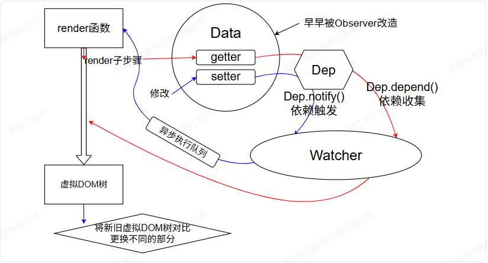

### Vue2 响应式原理的案例

```

<template>
  <div id="app">
    <div>用户名：{{ user.name }}</div>
    <div>年龄：{{ user.age }}</div>
    <button @click="addAgeDirectly">直接添加年龄（无响应式）</button>
  </div>
</template>

<script>
  name: 'vue2Dome1',
  data() {
    return {
      user: {
        name: '张三'
        },
        likelist: ["苹果", "香蕉", "橙子"]

    };
  },
  methods: {
    addAgeDirectly() {
        this.user.age = 10;
        this.likelist[1] = "方块西瓜"
        console.log('user.age:', this.user.age);
        console.log(this.user);
        console.log(this.likelist);
    },

  }
};
</script>
```

问题一：

1.  user.age属性是否添加成功？
2.  能否顺利输出user.age的值？
3.  视图中user.age会更新吗？

答案：

1.  会
2.  会
3.  不会

这就要讲到我们数据响应式更新的原理\[向下\]

### Vue2 数据响应式的原理

#### 核心组件（主流分类）：

| 核心组件                      | 核心定位   | 作用                                                            |
| ----------------------------- | ---------- | --------------------------------------------------------------- |
| `Observer`（观察者）          | 数据劫持层 | 把 `data` 里的所有属性变成 “可监听” 的响应式数据                |
| `Dep`（依赖收集器）           | 依赖存储层 | 给每个响应式属性 “配一个专属容器”，存依赖该属性的 `Watcher`     |
| `Watcher`（订阅者）           | 更新执行层 | 触发依赖收集 + 收到通知后执行更新（重新渲染 / 执行 watch 回调） |
| `VNode/Patch`（虚拟DOM/Diff） | 视图更新层 | 生成虚拟 DOM、对比新旧 VNode，最小化更新真实 DOM                |

#### 流程图



Vue 初始化过程中：

Data 中的属性会在 ，被 Observer 类通过 [Object.defineProperty ()](https://alidocs.dingtalk.com/i/nodes/dxXB52LJq0MZrKqvupkKmz1EVqjMp697?utm_scene=person_space&iframeQuery=anchorId%3Duu_mj2nv6xcknmlbq5peji 'Object.defineProperty ()')[](https://alidocs.dingtalk.com/i/nodes/wva2dxOW4DPO69eRfAX4pl1pWbkz3BRL?utm_scene=person_space&iframeQuery=anchorId%3Duu_mj1335foswlzju8ln2d '
')添加 getter/setter，转为响应式数据。

在执行 render 函数时：

需要访问 data 中的数据，触发对应属性的 getter；此时 [Dep](https://alidocs.dingtalk.com/i/nodes/dxXB52LJq0MZrKqvupkKmz1EVqjMp697?utm_scene=person_space&iframeQuery=anchorId%3Duu_mj2o6eyvbuq05m90xjj 'Dep') 检测（Dep.target， 指向渲染 Watcher）到当前有活跃的 [Watcher](https://alidocs.dingtalk.com/i/nodes/dxXB52LJq0MZrKqvupkKmz1EVqjMp697?utm_scene=person_space&iframeQuery=anchorId%3Duu_mj2ohxbixy3ybpzyqfe 'Watcher')，调用 dep.depend () 完成依赖收集（Dep 存入该 Watcher，Watcher 也记录对应的 Dep）。render 执行完成后生成虚拟 DOM 树，Vue 立刻调用 patch 方法将虚拟 DOM 树挂载为真实 DOM（首次渲染）。

当修改 data 数据时

触发对应属性的 setter；Dep 调用 notify () 遍历所有订阅（依赖）该数据的 Watcher，通知数据已更新。Watcher 收到通知后、去重（避免同一 Watcher 重复入队）、入队，再将队列交给 nextTick 放入异步微任务队列（等待本轮 JS 执行完）。异步队列执行时，Watcher 重新执行、 render 生成新的[虚拟 DOM 树](https://alidocs.dingtalk.com/i/nodes/dxXB52LJq0MZrKqvupkKmz1EVqjMp697?utm_scene=person_space&iframeQuery=anchorId%3Duu_mj2oj5ofprkxgpiipan '虚拟 DOM 树')，Vue 对比新旧虚拟 DOM 树（[Diff 算法](https://alidocs.dingtalk.com/i/nodes/dxXB52LJq0MZrKqvupkKmz1EVqjMp697?utm_scene=person_space&iframeQuery=anchorId%3Duu_mj2ojou4lxob5vua2fe 'Diff 算法')），只将差异部分更新为真实 DOM。

#### 具体实现（mini-vue2）

```
// 1. 依赖管理器：收集Watcher，通知更新
class Dep {
  constructor() {
    this.subs = []; // 存储所有依赖（Watcher实例）
  }

  // 添加依赖
  addSub(sub) {
    this.subs.push(sub);
  }

  // 通知所有依赖更新
  notify() {
    this.subs.forEach(sub => sub.update());
  }
}

// 2. 观察者：负责更新视图（模拟Vue的Watcher）
class Watcher {
  /**
   * @param {Object} vm 模拟Vue实例
   * @param {string} key 要观察的属性名
   * @param {Function} cb 属性变化时的回调（更新视图）
   */
  constructor(vm, key, cb) {
    this.vm = vm;
    this.key = key;
    this.cb = cb;

    // 把当前Watcher实例挂载到Dep.target，用于依赖收集
    Dep.target = this;
    // 触发getter，完成依赖收集
    this.vm[this.key];
    // 收集完成后清空，避免重复收集
    Dep.target = null;
  }

  // 触发更新回调
  update() {
    this.cb.call(this.vm, this.vm[this.key]);
  }
}

// 3. 数据劫持：对对象属性重写get/set
function defineReactive(obj, key, val) {
  // 每个属性对应一个Dep实例
  const dep = new Dep();

  Object.defineProperty(obj, key, {
    enumerable: true, // 可枚举
    configurable: true, // 可配置
    // 读取属性时触发
    get() {
      // 如果有Watcher在等待收集依赖，就添加到Dep
      if (Dep.target) {
        dep.addSub(Dep.target);
      }
      return val;
    },
    // 修改属性时触发
    set(newVal) {
      if (newVal === val) return; // 值未变化则不处理
      val = newVal;
      // 通知所有依赖更新
      dep.notify();
    }
  });
}

// 4. 响应式处理：遍历对象所有属性，实现劫持
function observe(obj) {
  // 只处理对象（简化版，忽略数组）
  if (typeof obj !== 'object' || obj === null) {
    return;
  }
  // 遍历对象属性，逐个劫持
  Object.keys(obj).forEach(key => {
    defineReactive(obj, key, obj[key]);
  });
}

// 5. 模拟Vue实例
class Vue {
  constructor(options) {
    this.$data = options.data(); // 模拟Vue的data选项
    // 对data进行响应式处理
    observe(this.$data);

    // 把data的属性代理到Vue实例上（简化版，模拟vm.xxx访问data.xxx）
    Object.keys(this.$data).forEach(key => {
      Object.defineProperty(this, key, {
        get() {
          return this.$data[key];
        },
        set(newVal) {
          this.$data[key] = newVal;
        }
      });
    });

    // 模拟挂载阶段：创建Watcher，关联属性和更新逻辑
    if (options.watch) {
      Object.keys(options.watch).forEach(key => {
        new Watcher(this, key, options.watch[key]);
      });
    }
  }
}

// 测试代码
const vm = new Vue({
  data() {
    return {
      msg: 'Vue2响应式'
    };
  },
  watch: {
    msg(newVal) {
      console.log('视图更新：', newVal);
    }
  }
});

// 修改属性，触发响应式
vm.msg = 'Hello Vue2'; // 输出：视图更新：Hello Vue2
vm.msg = '数据劫持+依赖收集'; // 输出：视图更新：数据劫持+依赖收集
```

---

那么经过上述讲解，大家都知道Vue2实现数据劫持是依靠Object.defineProperty()，但是这种方式有一个缺点：无法拦截新增的属性。

so，what should we do?

### 应用： 如何给实例新增响应式属性?

##### Vue.set/this.$set

vue2官方推荐的新增响应式属性的方式，适用于对象 / 数组场景。

1.  基本语法

```
// 全局方法
Vue.set(target, propertyName/index, value)

// 实例方法（更常用）
this.$set(target, propertyName/index, value)


// target：目标对象（响应式）或数组
// propertyName/index：对象属性名（字符串）或数组索引（数字）
// value：新增属性的取值
```

##### 给对象新增响应式对象

```
export default {
  name: 'vue2Dome2',
  data() {
    return {
      user: {
        name: '张三'
      }
    };
  },
  methods: {
    addAgeWithSet() {
      this.$set(this.user, 'age', 20);
    }
  }
};
```

##### 给数组新增 / 修改元素

修改数组元素

```
this.$set(this.likelist, 1, '西瓜')
//超出数组索引式新增
this.$set(this.likelist,this.likelist.length,'阳光青提')

//注意当我们直接用push（）方法给数组新增元素时，视图也会更新。
```

Vue 2 为了解决数组下标修改无法检测的问题，重写了数组的 7 个原生变异方法，这些方法调用后会自动触发依赖更新（视图刷新）

| 方法        | 说明                         |
| ----------- | ---------------------------- |
| `push()`    | 向数组末尾添加元素           |
| `pop()`     | 删除数组最后一个元素         |
| `shift()`   | 删除数组第一个元素           |
| `unshift()` | 向数组开头添加元素           |
| `splice()`  | 增 / 删 / 改数组元素（万能） |
| `sort()`    | 数组排序                     |
| `reverse()` | 数组反转                     |

那么也就是说，如果我们想响应式更新数组中的元素有多了一种方法。

使用这些Vue2重新封装了的原生变异方法，其中最万能的：

splice(起始下标，\*操作数量，插入元素)

示例：

```
this.likelist.splice(0, 1, '火晶柿子')//修改索引0
this.likelist.splice(this.likelist.length,1,'东北冻梨')//添加
```

一句话总结：Vue.set/this.$set给响应式对象添加响应式数据

仅对「响应式对象的不存在属性」生效：绑定 `get/set` + 触发视图更新；

对「已存在的属性」：

若属性本身是响应式（初始化声明）→ 等价于普通赋值，仍触发更新；

若属性是非响应式（直接赋值新增）→ 仅普通赋值，无响应式处理（看似 “失效”）；

对「非响应式对象」→ 仅普通赋值，无任何响应式处理。

`$set` 是 Vue2 给「响应式对象新增属性」的 “专属补丁”，对已存在的属性，它只是个 “普通赋值工具”

---

除此之外，我们运用扩展运算符也可以实现对新增响应式属性

原理：扩展运算符会浅拷贝原对象的所有属性，并合并新增属性生成一个新对象；再通过 Vue 的响应式 API（Vue 2 的 `Vue.set`/`Vue.observable`、Vue 3 的 `reactive`/`ref`）将新对象设为响应式，从而让新增属性具备响应式特性。

也就是说，这种方法相当于重新创建了一个同名的响应式对象，合并了新属性（替换式新增），达成了既“新增”又“响应式”的结果。
